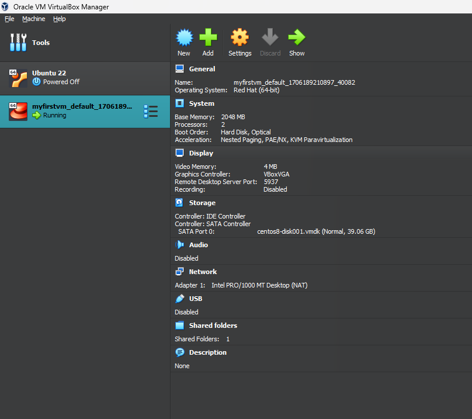
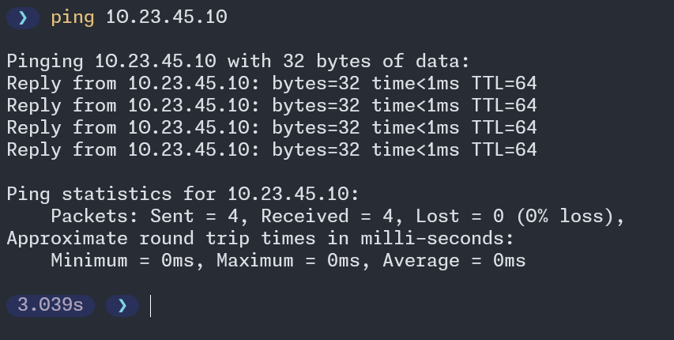

```shell
vagrant box add jasonc/centos8
```

```shell
mkdir myfirstvm 
```


```shell
❯ vagrant up
Bringing machine 'default' up with 'virtualbox' provider...
==> default: Importing base box 'jasonc/centos8'...
==> default: Matching MAC address for NAT networking...
==> default: Checking if box 'jasonc/centos8' version '1.0.4' is up to date...
==> default: Setting the name of the VM: myfirstvm_default_1706189210897_40082
Vagrant is currently configured to create VirtualBox synced folders with
the `SharedFoldersEnableSymlinksCreate` option enabled. If the Vagrant
guest is not trusted, you may want to disable this option. For more
information on this option, please refer to the VirtualBox manual:

  https://www.virtualbox.org/manual/ch04.html#sharedfolders

This option can be disabled globally with an environment variable:

  VAGRANT_DISABLE_VBOXSYMLINKCREATE=1

or on a per folder basis within the Vagrantfile:

  config.vm.synced_folder '/host/path', '/guest/path', SharedFoldersEnableSymlinksCreate: false
==> default: Clearing any previously set network interfaces...
==> default: Preparing network interfaces based on configuration...
    default: Adapter 1: nat
==> default: Forwarding ports...
    default: 22 (guest) => 2222 (host) (adapter 1)
==> default: Booting VM...
==> default: Waiting for machine to boot. This may take a few minutes...
    default: SSH address: 127.0.0.1:2222
    default: SSH username: vagrant
    default: SSH auth method: private key
    default:
    default: Vagrant insecure key detected. Vagrant will automatically replace
    default: this with a newly generated keypair for better security.
    default:
    default: Inserting generated public key within guest...
==> default: Machine booted and ready!
==> default: Checking for guest additions in VM...
    default: The guest additions on this VM do not match the installed version of
    default: VirtualBox! In most cases this is fine, but in rare cases it can
    default: prevent things such as shared folders from working properly. If you see
    default: shared folder errors, please make sure the guest additions within the
    default: virtual machine match the version of VirtualBox you have installed on
    default: your host and reload your VM.
    default:
    default: Guest Additions Version: 6.1.32 r149290
    default: VirtualBox Version: 7.0
==> default: Mounting shared folders...
    default: /vagrant => C:/Users/USER/Documents/GitHub/DevOps-in-the-Real-World-2023-7/linuxClass/myfirstvm
```



to check the status of the VM
```shell
vagrant status
```


